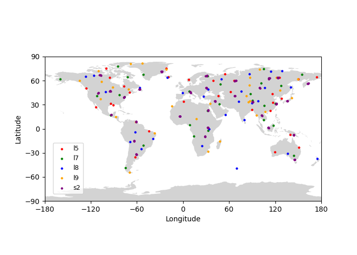
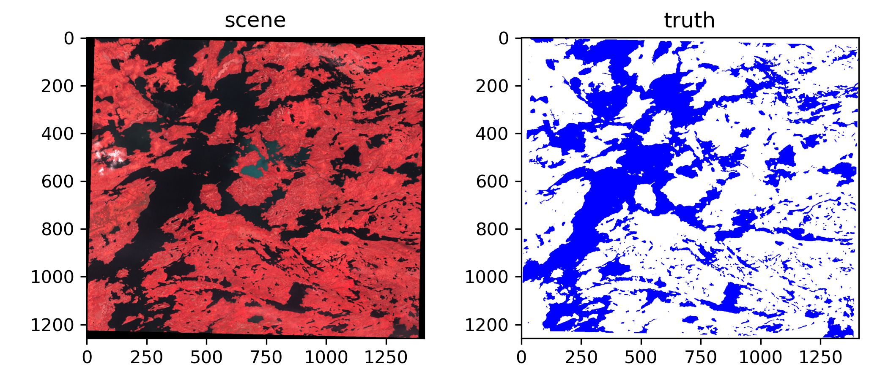
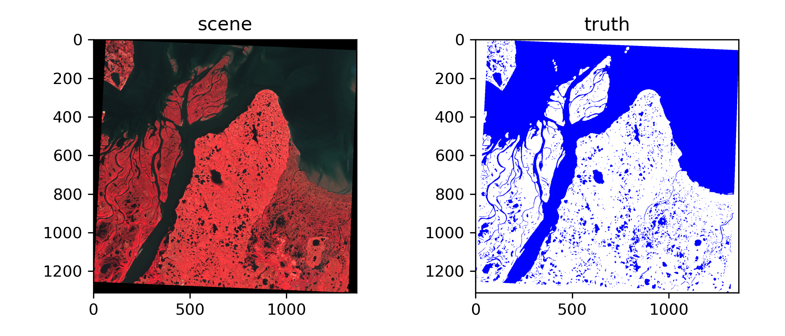
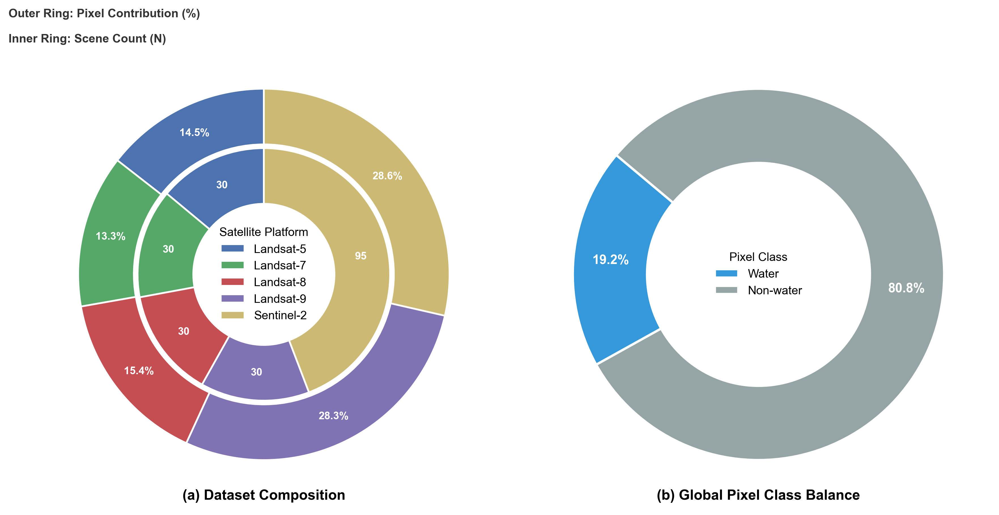
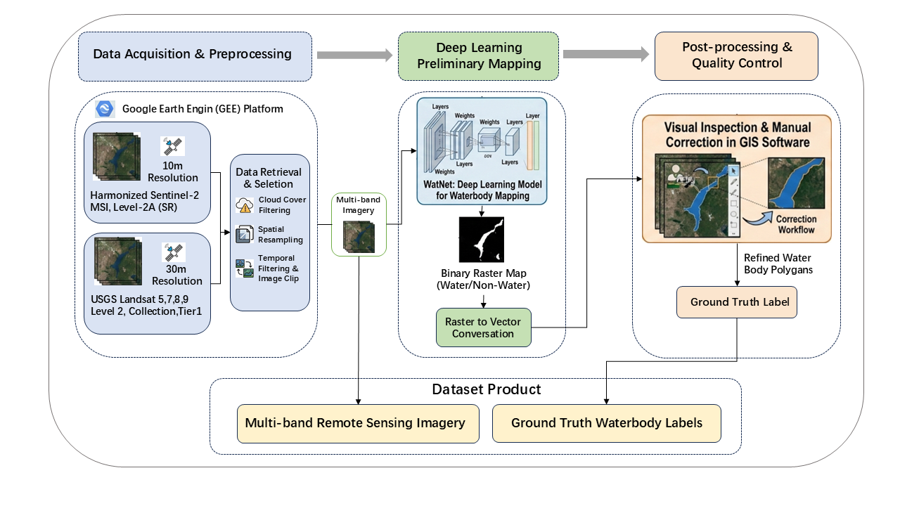

# **WatSet (Surface water dataset for deep learning)**

### **--- Title**

Deep learning-based water bodies mapping using Landsat-5, 7, 8 , 9 images and Sentinel 2 images .

## 📊 Dataset Description

This dataset focuses on multispectral water body segmentation, integrating optical imagery from multiple satellite platforms (**Landsat-5/7/8/9** and **Sentinel-2**) to ensure model robustness across different resolutions and sensors.

### 1. Data Diversity & Distribution
To evaluate generalization capability, the dataset includes scenes with varying water body sizes and geographical locations.

- **Geographical Distribution (Fig 1):** Samples are collected globally across **Asia, Europe, North America, South America, Africa, and Oceania**, ensuring no spatial bias towards a specific region.

  

  <em>Figure 1: Global geographical distribution of the dataset scenes, color-coded by satellite sensor.</em>

 

Each sample consists of a multispectral optical image and a pixel-level binary ground truth mask **(Fig 2)**. 
- **Scene:** Images are visualized in **True Color (RGB)** using sensor-specific band combinations and robust 2%-98% percentile stretching.
- **Ground Truth:** Binary masks where **White** indicates background and **Blue** indicates water.

  

  

  <em>Figure 2: Representative samples. Left: True Color RGB images; Right: Ground Truth water masks.</em>

### 2. Statistical Overview
The dataset structure is analyzed in **Figure 3**, providing a dual-perspective on data composition:

- **(a) Dataset Composition (Left):** A nested donut chart illustrating the data source distribution.
    - **Outer Ring:** Represents the **Pixel Contribution (%)**. This reflects the total data volume used for training.
    - **Inner Ring:** Displays the explicit **Scene Count (N)**. 
    - *Insight:* Comparing the rings reveals sensor characteristics; for instance, Sentinel-2 may have fewer scenes (Inner) but contributes a significant number of pixels (Outer) due to high resolution or larger swath coverage.
- **(b) Class Balance (Right):** Shows the global ratio between Water and Non-water (Background) pixels, highlighting the class imbalance typical in remote sensing tasks.

 
  

  <em>Figure 3: (a) Nested donut chart showing pixel contribution (Outer) vs. scene count (Inner); (b) Global water vs. non-water pixel ratio.</em>

### 3. Dataset Generation Workflow
As illustrated in **Figure 4**, the dataset was constructed through a streamlined three-step pipeline to ensure high quality and accuracy.

 
  

  <em>Figure 4: The overall workflow of the proposed remote sensing waterbody dataset construction.</em>

1. **Data Acquisition & Preprocessing:** Multi-source satellite imagery (10m Sentinel-2 and 30m Landsat series) was retrieved and preprocessed (cloud filtering, clipping, and spatial resampling) using the Google Earth Engine (GEE) platform.

2. **Deep Learning Preliminary Mapping:** A deep learning model (WatNet) was utilized to automatically generate initial waterbody boundaries, which were then converted from raster to vector format. 
3. **Post-processing & Quality Control:** GIS experts conducted rigorous visual inspection and manual correction on the preliminary vectors to produce the final, highly accurate Ground Truth Labels.

### **---To do**
